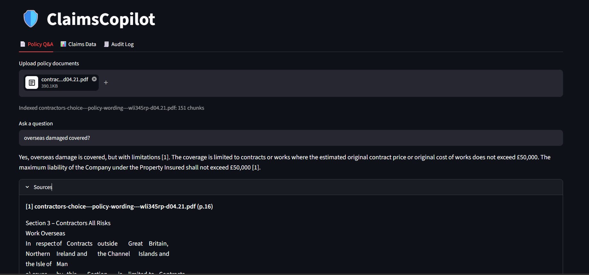
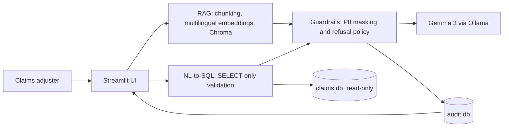

# 🛡️ ClaimsCopilot: an on-prem GenAI workbench for insurance claims teams

> A client case study: policy Q&A with citations, plain-English claims analytics, PII guardrails and a full audit trail, running entirely on a local open-weights model.



---

## 1. The client problem

A mid-size insurer's claims adjusters lose hours to two recurring tasks:

1. **Finding the right clause.** Coverage questions ("is a gradual leak covered?") mean searching through long policy PDFs.
2. **Waiting for data.** Simple questions about the claims book ("open auto claims over €10k in Lombardy") go through an analyst queue.

The constraint that shapes the solution: **claims data is personal and regulated, so sending it to an external AI API is a non-starter.** The platform has to run inside the client's perimeter, show its sources, and leave an audit trail.

## 2. The solution

ClaimsCopilot is a Streamlit workbench backed by a local LLM (Gemma 3 via Ollama). All data stays on the machine.

| Capability | What it does |
|---|---|
| **Policy Q&A (RAG)** | Answers coverage questions from policy documents, with numbered citations to the retrieved passages. Multilingual retrieval (EN/IT). Refuses when the documents don't contain the answer. |
| **Claims data assistant (NL-to-SQL)** | Turns a plain-English question into a single read-only SQL `SELECT`, shows the generated SQL, then renders a table and (where it fits) a bar chart. |
| **Guardrails** | Masks PII (email, phone, IBAN, Italian fiscal code) *before* text reaches the model or the log. Refuses prompt-injection attempts and destructive requests. |
| **Audit log** | Every LLM call is recorded in SQLite: timestamp, module, masked prompt, answer, sources, PII types found, and any refusal reason. Viewable in the app. |
| **Evaluation suite** | Measures retrieval hit-rate, LLM-judged faithfulness, and correct refusal on out-of-scope questions. |

## 3. Architecture



**Key design decisions**

- **One choke point for the model.** Every call goes through `ask()` in `src/llm.py`, which applies guardrails and writes the audit record. No module can bypass masking or logging.
- **Defense in depth for SQL.** The generated query is (1) validated as a single `SELECT` with a keyword blocklist, then (2) executed on a connection opened in SQLite read-only mode, so even a validation bypass cannot write.
- **Swappable backend.** The LLM is isolated in a single file, so moving from a local model to a managed endpoint is a one-file change.
- **Multilingual embeddings** (`paraphrase-multilingual-MiniLM-L12-v2`), so Italian questions retrieve English clauses.
- **Synthetic data only.** Policies are LLM-generated for a fictional insurer, and claims are randomly generated. No real customer data is used anywhere.

## 4. Evaluation

Run on synthetic data, 45 questions total.

| Metric | Result |
|---|---|
| Retrieval hit-rate@5 (40 Qs) | **72%** |
| Faithfulness (13 answered Qs, LLM-judged) | **100%** |
| Correct refusals on out-of-scope Qs | **4/5** |

**Method**

- *Retrieval:* questions were generated from indexed chunks by the LLM and then reviewed by hand. A hit means one of the top-5 retrieved chunks contains the source passage (matched on a text anchor, so results stay comparable when chunk size changes).
- *Faithfulness:* an LLM judge (Phi-4-mini, a different model family from the Gemma 3 generator, to reduce self-preference bias) checks whether every claim in an answer is supported by the retrieved context. Abstentions ("I cannot find this…") are excluded from the denominator, since an abstention is trivially faithful. A control test with a deliberately fabricated answer checks that the judge can say "NO" (`evals/judge_check.py`).
- *Refusals:* 5 out-of-scope questions (weather, Mars colonization, etc.); the system should answer "I cannot find this in the provided documents."

**Known failure.** "What is the CEO's salary?" was not refused: retrieval returned an unrelated clause about directors' daily allowances, and the model answered from it. Vector search always returns its nearest neighbours, even when nothing is relevant, and a small model will rationalise them. The standard fix is a relevance cutoff on retrieval distance before the LLM is called (see *Next steps*).

**Limitations.** Synthetic documents; a small (4B-class) local model; a small-model judge; small samples. Hit-rate questions are generated from the documents themselves and share their vocabulary, so real-user retrieval would likely score lower. Treat these numbers as indicative, not as production benchmarks.

<!-- OPTIONAL: if you run evals/tune.py and improve retrieval, paste your tuning table here and update the numbers above:

### Retrieval tuning (hit-rate by chunk size / k)
| chunk | overlap | k=3 | k=5 |
|---|---|---|---|
| ... | ... | ... | ... |

Baseline 72% → xx% after changing chunk size to xxx.
-->

## 5. Tech stack

| Layer | Choice |
|---|---|
| UI | Streamlit |
| LLM | Gemma 3 (4B, quantized) served locally by Ollama |
| Embeddings / vector store | `paraphrase-multilingual-MiniLM-L12-v2` (sentence-transformers) + ChromaDB |
| Structured data | SQLite (claims, audit log) |
| Guardrails | Regex-based PII masking + rule-based refusal policy |

## 6. Project structure

```
claimscopilot/
├── app.py                  # Streamlit UI: Policy Q&A, Claims Data, Audit Log tabs
├── src/
│   ├── llm.py              # Single entry point to the model: guardrails + audit wrapper
│   ├── rag.py              # Ingestion, chunking, retrieval, grounded answering
│   ├── sql_assistant.py    # NL-to-SQL with SELECT-only validation, read-only execution
│   ├── guardrails.py       # PII masking and refusal rules
│   ├── audit.py            # SQLite audit log
│   ├── synth_policies.py   # Generates fictional policy documents
│   └── make_claims_db.py   # Generates 500 fake claims
├── evals/
│   ├── make_qa.py          # Builds the question set from indexed chunks
│   ├── add_anchors.py      # Adds chunk-size-independent ground-truth anchors
│   ├── run_eval.py         # Hit-rate, faithfulness, refusal metrics
│   ├── judge_check.py      # Control test for the LLM judge
│   ├── tune.py             # Chunk-size / k sweep
│   └── qa.json             # The evaluation set
├── data/policies/          # Synthetic policy documents
└── requirements.txt
```

## 7. Run it locally

**Prerequisites:** Python 3.11+, [Ollama](https://ollama.com) with a Gemma 3 model pulled.

```bash
# 1. Model
ollama pull gemma3:4b            # or any Gemma 3 tag you have
export LOCAL_MODEL=gemma3:4b     # PowerShell: $env:LOCAL_MODEL = "gemma3:4b"

# 2. Environment
python -m venv .venv
source .venv/bin/activate        # Windows: .venv\Scripts\activate
pip install -r requirements.txt

# 3. Data (synthetic) and index
python -m src.synth_policies     # fictional policy documents
python -m src.make_claims_db     # 500 fake claims
python -m src.rag                # build the vector index

# 4. Launch
streamlit run app.py
```

Run all commands from the project root. The default model tag is set in `src/llm.py` and can be overridden with the `LOCAL_MODEL` environment variable.

**Try these**

- *Policy Q&A:* "Is a gradual leak covered under home insurance?" · "È coperto il furto del bagaglio?" · "What is the weather in Milan today?" (should refuse)
- *Claims Data:* "Total claim amount by region" · "Show open auto claims over 10000 in Lombardy" · "Delete all claims" (should be blocked)
- *Guardrails:* include an email and an IBAN in a question, then open the **Audit Log** tab and see them masked.

## 8. Run the evaluation

```bash
python -m evals.make_qa            # generate questions (then review qa.json by hand)
python -m evals.add_anchors        # add robust ground-truth anchors
python -m evals.judge_check        # control: the judge must answer NO on fabricated answers
python -m evals.run_eval 15        # metrics; the argument is the faithfulness sample size
python -m evals.tune               # optional: chunk-size / k sweep
```

To use a different model as judge, set `JUDGE_MODEL` before running (PowerShell: `$env:JUDGE_MODEL = "<ollama tag>"`).

## 9. Security, privacy and responsible-AI notes

- **Data residency:** nothing leaves the machine. The model, embeddings, vector store and databases are all local.
- **PII masking** happens before the model call *and* before the audit write, so raw identifiers are never stored. The patterns (email, phone, IBAN, Italian fiscal code) are demonstration-grade; production use needs a vetted PII-detection service and locale-specific testing.
- **Refusal policy:** prompt-injection phrases and destructive SQL intents are refused and logged with the reason.
- **SQL safety:** SELECT-only validation plus a read-only database connection; generated SQL is always shown to the user.
- **Grounding:** answers must cite retrieved passages and abstain when the documents don't cover the question. The model is instructed not to give legal advice.
- **Human in the loop:** the tool assists adjusters and does not make or recommend claim decisions.

## 10. Scaling to production (AWS / Azure)

| Concern | Production approach |
|---|---|
| **Model serving** | Amazon Bedrock / SageMaker, or Azure OpenAI / Azure ML endpoints; or self-hosted open-weights models on GPU nodes with vLLM, behind the same `ask()` interface. |
| **Vector search** | OpenSearch, pgvector, or Azure AI Search instead of local Chroma, with metadata filters (policy type, language, effective date). |
| **Claims data** | Warehouse (RDS/Redshift, Snowflake, or Databricks) with a dedicated read-only role and row/column-level security for the SQL assistant. |
| **Documents** | S3 / Blob Storage with an event-driven ingestion pipeline (parse, chunk, embed, index) and versioning of policy wordings. |
| **Runtime** | Containers on ECS/EKS or AKS; secrets in Secrets Manager / Key Vault; SSO through IAM Identity Center / Microsoft Entra ID. |
| **Observability and MLOps** | Tracing and cost/latency monitoring (CloudWatch / Azure Monitor, LangSmith or similar); the eval suite as a CI gate on every prompt, model or chunking change. |
| **Compliance** | GDPR data-residency and retention rules for audit logs, ship logs to a SIEM, DPIA for the use case, human approval for any claim decision. |

## 11. Next steps

- **Relevance cutoff on retrieval** so out-of-scope questions are refused before the LLM is called (targets the known failure above).
- **Claim intake extraction:** unstructured emails/PDFs to validated JSON, with per-field confidence and a human-review flag.
- **Language detection and routing:** detect incoming language, translate, classify intent, route to the right queue.
- **Fraud/risk triage:** rule-based flags (inconsistent dates, duplicates, outlier amounts) with LLM-written explanations; rules decide, the model only explains.
- **Stronger evaluation:** a larger, human-written question set, including Italian and German, and a stronger judge model.

## 12. Disclaimer

Portfolio project built on **synthetic data** for a fictional insurer. It is not insurance, legal or financial advice, and it is not a production claims system.

---

*Built by Arindam Gupta · [GitHub](https://github.com/arindamguptama2025)*
